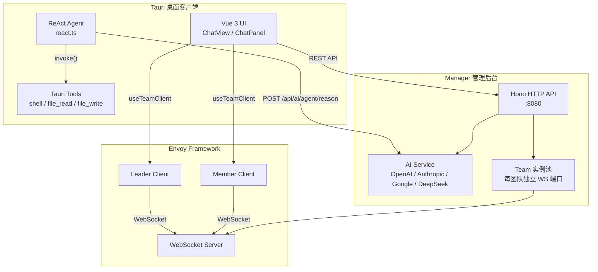
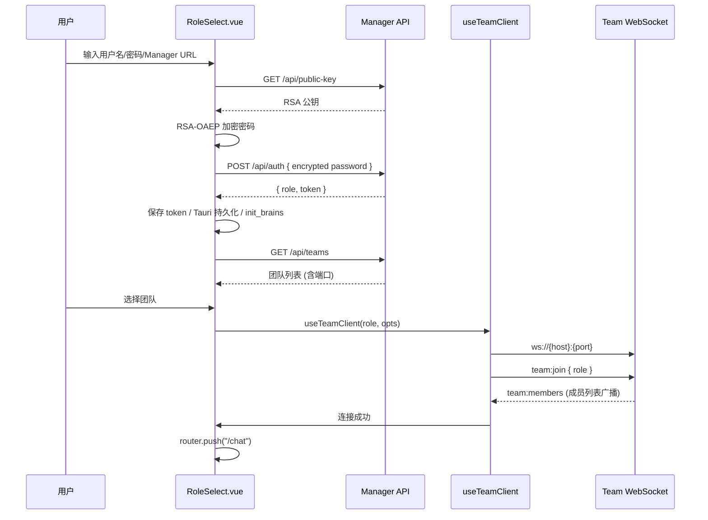
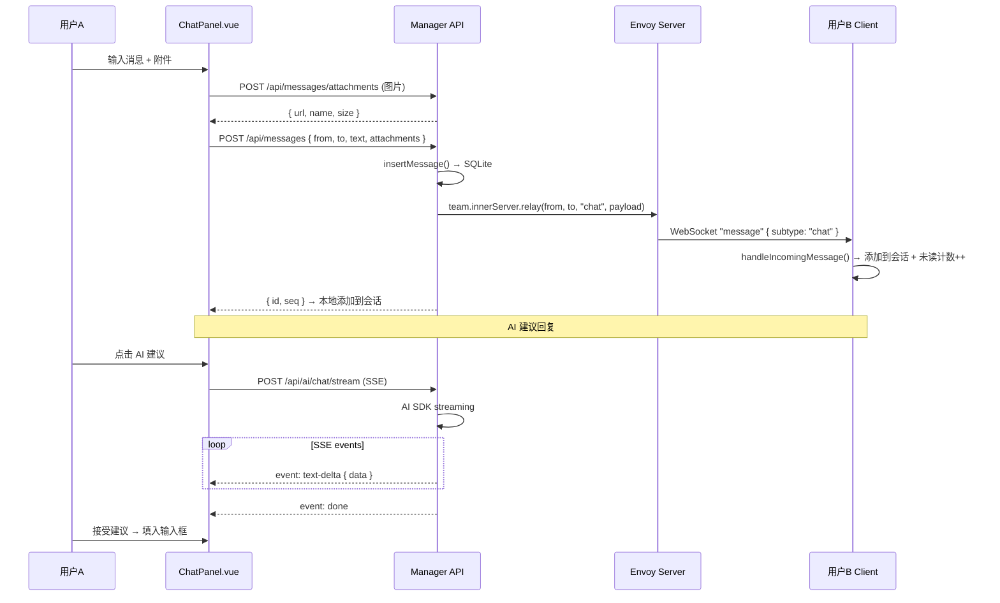
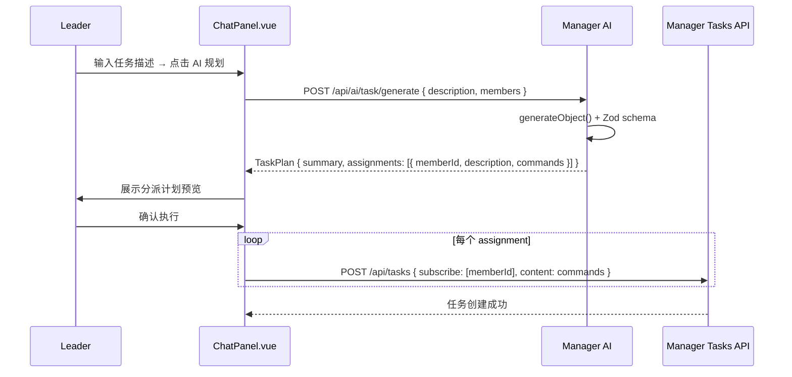
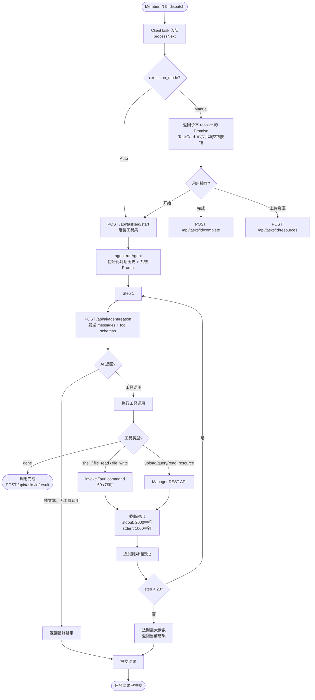
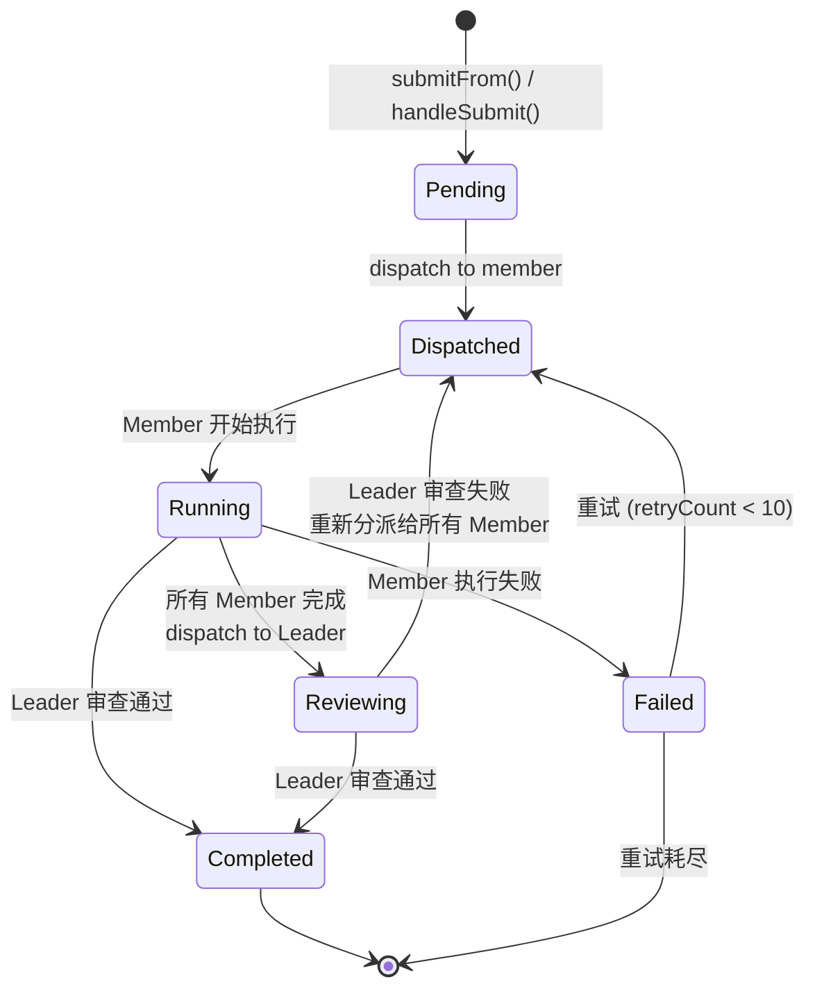
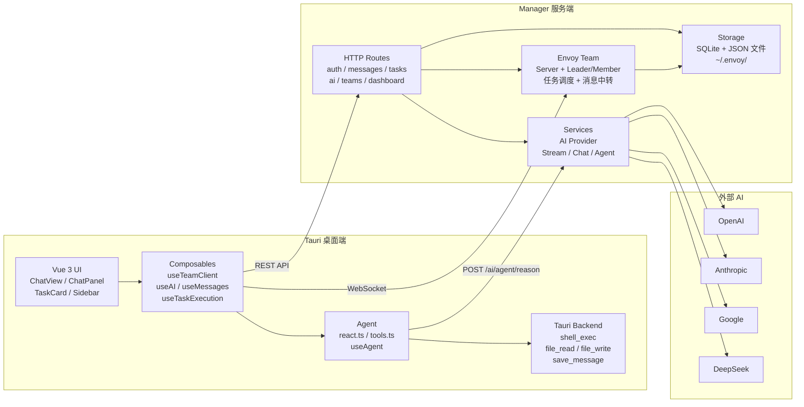
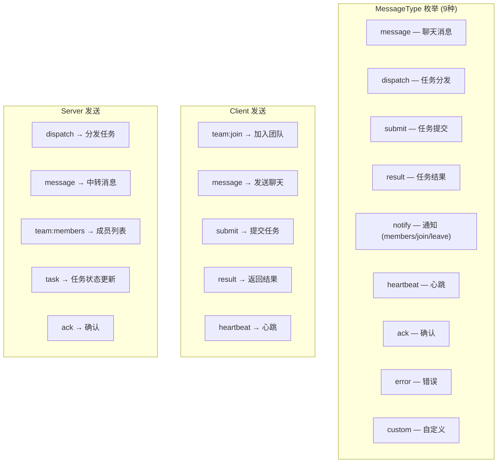
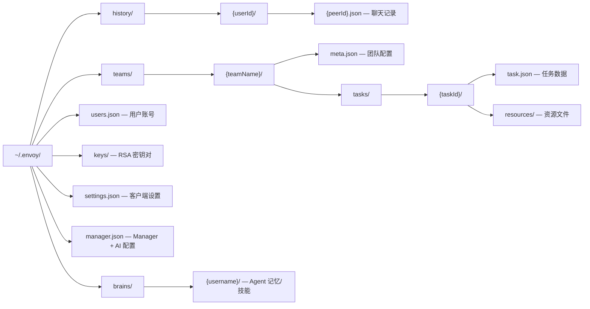

# EnvoyClient 项目流程图

> 使用 Mermaid 语法，可在 GitHub / VS Code (Mermaid Preview) / Typora 等工具中直接渲染。

---

## 1. 系统架构总览



---

## 2. 登录与连接流程



---

## 3. 聊天消息流程



---

## 4. 任务分派流程（手动 + AI 智能分派）

```mermaid
flowchart TD
    Start([Leader 输入任务描述]) --> Choice{分派方式?}

    Choice -->|手动选择成员| Manual[选择目标成员]
    Choice -->|AI 智能匹配| AI[POST /api/ai/task/dispatch]

    AI --> AIResult[AI 返回:<br/>subscribe: 成员ID列表<br/>content: 优化后描述]
    AIResult --> Preview[预览 AI 分派结果]
    Preview --> Confirm{Leader 确认?}
    Confirm -->|取消| Start
    Confirm -->|确认| Dispatch

    Manual --> Dispatch[POST /api/tasks<br/>{ from, content, subscribe, mode }]

    Dispatch --> Server[Team Server.submitFrom]
    Server --> TaskCreated[创建 Task → status: pending]
    TaskCreated --> Mode{TaskMode?}

    Mode -->|Serial| Serial[dispatch → subscribe 第1人]
    Mode -->|Parallel| Parallel[dispatch → 所有 subscribe]

    Serial --> MemberExec1[Member 执行完成]
    MemberExec1 --> SerialNext{还有下一个?}
    SerialNext -->|是| SerialNextDispatch[dispatch → 下一个 Member]
    SerialNextDispatch --> MemberExec1
    SerialNext -->|否| LeaderReview

    Parallel --> MemberExecN[所有 Member 并行执行]
    MemberExecN --> AllDone{全部完成?}
    AllDone -->|是| LeaderReview

    LeaderReview([Leader 审查])
    LeaderReview --> LeaderResult{审查结果?}
    LeaderResult -->|通过| Completed([Task 完成])
    LeaderResult -->|失败| Retry{重试次数 < 10?}
    Retry -->|是| Serial
    Retry -->|否| Failed([Task 失败])
```

---

## 5. AI 任务规划流程



---

## 6. Agent ReAct 执行循环



---

## 7. 任务状态生命周期



---

## 8. 三层数据流全景



---

## 9. Envoy 框架消息协议



---

## 10. 文件存储结构


